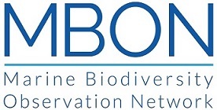
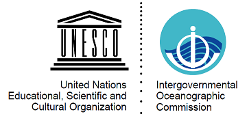

--- 
title: "3rd Marine Biodiversity Workshop: from the Sea to the Cloud"
date: "May 4-8, 2020"
site: bookdown::bookdown_site
output: bookdown::gitbook
documentclass: book
bibliography: [style/zotero_mbon-p2p.bib, style/packages.bib]
biblio-style: apalike
link-citations: yes
github-repo: marinebon/p2p-colombia-workshop
description: "This is a minimal example of using the bookdown package to write a book. The output format for this example is bookdown::gitbook."
---

```{r include=FALSE, eval=F}
# automatically create a bib database for R packages
knitr::write_bib(c(
  .packages(), 'bookdown', 'knitr', 'rmarkdown'
), 'style/packages.bib')
```

```{r setup, include=FALSE}
library(tidyverse)
library(knitr)
library(kableExtra)
library(leaflet)
library(sf)
opts_chunk$set(echo = F)
```
# [MBON Pole to Pole of the Americas](https://marinebon.org/p2p/)
-- **Location: Santa Marta, Colombia** <br>
-- **Dates: May 4-8, 2020**

   
<br>
   

```{r, eval=F}
library(tidyverse)
library(knitr)
library(kableExtra)

options(knitr.kable.NA = '')
agenda <- readxl::read_excel("data/agenda.xlsx") %>%
  select(Time, Description)

# detect within-row headers by rows in first column Time that begin with "Aug "
i_groups         <- which(str_detect(agenda$Time, "^Aug "))
agenda_nongroups <- slice(agenda, -i_groups)
agenda_groups    <- slice(agenda, i_groups) %>% .$Time
i_group_rows     <- diff(c(i_groups, nrow(agenda))) - 1
groups_i         <- setNames(i_group_rows, agenda_groups)

if (is_latex_output()){
  kable(agenda_nongroups, "latex") %>%
    group_rows(index = groups_i) %>%
    column_spec(1, width = "0.5in")
} else {
  kable(agenda_nongroups, "html") %>%
    kable_styling("striped", full_width = T, font_size = 11) %>%
    group_rows(index = groups_i)
}
```

## Workshop Objectives

The [MBON Pole to Pole](https://marinebon.org/p2p/) is preparing a third workshop to build on activities and achieved goals from training activities in [Brazil](https://marinebon.org/p2p-brazil-workshop/) and [Mexico](https://marinebon.org/p2p-mexico-workshop/). The purpose is to continue the development of a community of practice dedicated to understanding change in marine biodiversity and generating knowledge and products that inform conservation and management efforts across the Americas. 

During this workshop participants will:

1. Develop a set of indicators of biodiversity change in coastal communities;
1. Develop a comprehensive list of macro-invertebrate and macro-algae species for the region;
1. Agree on a minimum set of physical variables that should be collected during biodiversity surveys of coastal areas;
1. Learn to access and use [satellite seascapes](https://coastwatch.noaa.gov/cw/satellite-data-products/multi-parameter-models/seascape-pelagic-habitat-classification.html) and other remote sensing variables to characterize environmental conditions at survey sites; 
1. Test methods for surveying rocky shore biodiversity using photo-quadrats and imagery analysis;
1. Develop specific Dawin Core vocabularies for flora and fauna of rocky shore and sandy beach communities;
1. Continue to publish survey datasets collected during 2019 and 2020 to the Ocean Biogeographic Information System ([OBIS](http://www.iobis.org/));
1. Analyze survey data collected since [NaGISA](http://www.coml.org/natural-geography-shore-areas-nagisa/) to the present to examine biogeographical patterns and detect biodiversity change in coastal communities.
 


## Logistics

Workshop dates: **May 4-8, 2020** (+2 days for travel)

- **Venue:** 
 Marine and Coastal Research Institute "José Benito Vives de Andréis" ([INVEMAR](http://www.invemar.org.co/)) <br>
Santa Marta <br> 
Magdalena, Colombia


```{r}
pts <- tribble(
        ~lon,       ~lat,       ~name,    ~icon,   ~color,          ~description,                                ~comment,
  -74.2327, 11.1172, "Simon Bolivar International Airport", "plane", "green",   "International Airport", NA,
  -74.2261, 11.19194,      "INVEMAR", "home", "red", "Host institution for the workshop", NA,
  -74.07, 11.31,   "Tayrona National Park", "rocket", "orange",  "Tayrona National Park", NA) %>%
  st_as_sf(coords = c("lon", "lat"), crs = 4326)

ctr <- pts$geometry %>% st_geometrycollection() %>% st_centroid() %>% st_coordinates()

icons <- awesomeIcons(
  icon = pts$icon,
  iconColor = 'black',
  library = 'fa',
  markerColor = pts$color)

leaflet(pts, options = leafletOptions(attributionControl=F)) %>%
  #addProviderTiles(provider = providers$Stamen.TonerLite) %>%
  addProviderTiles(provider = providers$Esri.NatGeoWorldMap, options = tileOptions(opacity=0.5)) %>%
  addAwesomeMarkers(icon = icons, label= ~name, labelOptions = labelOptions(noHide = T)) %>%
  setView(ctr[,"X"], ctr[,"Y"], zoom=10)
```

## Organizers

-	Marine Biodiversity Observation Network Pole to Pole of the Americas - [MBON Pole to Pole](https://marinebon.org/p2p/)
- [MarineGEO](https://marinegeo.si.edu/) and the Tennenbaum Marine Observatories Network of the Smithsonian Institution 
-	Marine and Coastal Research Institute "José Benito Vives de Andréis" ([INVEMAR](http://www.invemar.org.co/))
-	[AmeriGEO](https://www.amerigeoss.org/) - Group on Earth Observations
-	Ocean Biogeographic Information System ([OBIS](http://www.iobis.org/); IOC-UNESCO)
- Global Ocean Observing System ([GOOS](http://www.goosocean.org/); IOC-UNESCO)
- Ocean Best Practice System ([OBPS](https://www.oceanbestpractices.net/); IOC-UNESCO)
- Ocean Teacher Global Academy ([OTGA](https://classroom.oceanteacher.org/))

## Workshop rationale

The [MBON Pole to Pole](https://marinebon.org/p2p/) is organizing a third **Marine Biodiversity Workshop - From the Sea to the Cloud** after two successful workshops held in [Brazil](https://marinebon.org/p2p-brazil-workshop/) and [Mexico](https://marinebon.org/p2p-mexico-workshop/) since 2018. This activity advances the implementation of the [MBON Pole to Pole](https://marinebon.org/p2p/) network by enhancing knowledge on field data collection methods and use of informatic technologies for data management and analysis. 

The [MBON Pole to Pole](https://marinebon.org/p2p/) aims to address the biodiversity priorities of various GEO initiatives, including [GEO Blue Planet](https://geoblueplanet.org/) and [AmeriGEO](https://www.amerigeoss.org/), and coordinates with the Global Ocean Observing System ([GOOS](https://www.goosocean.org/)) and the Ocean Best Practice System ([OBPS](https://www.oceanbestpractices.net/)) of the Intergovernmental Oceanographic Commission of UNESCO,  [OBIS](http://www.iobis.org/), and other national and international groups to serve the broadest possible community. This network aims to help nations and regions to improve conservation planning and environmental impact mitigation, serve the scientific community, and satisfy commitments to the Intergovernmental Science-Policy Platform on Biodiversity and Ecosystem Services (IPBES), Aichi Targets of the Convention of Biological Diversity (CBD), and the UN 2030 Agenda for Sustainable Development Goals (SDG’s).

The MBON Pole to Pole workshops:

- enhance coordination of data collection among nations;
- improve the collection of harmonized data, developing data standards and methodologies for data management and dissemination without compromising national concerns;
- support the integration of biodiversity information with physical and chemical data over time (status and trends); and
- generates products needed for informed policy and management of the ocean.

The workshop targets investigators and resource managers dedicated to studying and conserving biodiversity of rocky shore intertidal zone, sandy beaches and seagrass communities. This activity will be carried out in partnership with the Coordinated Global Research Assessment of Seagrass System ([C-GRASS](https://scor-int.org/group/coordinated-global-research-assessment-of-seagrass-system-c-grass/)) led by [MarineGEO](https://marinegeo.si.edu/) and [UNEP-WCMC](https://www.unep-wcmc.org/). This activity targets participants from all nations in the Americas, from pole to pole.

## Instructors
- Enrique Montes ([IMaRS](http://imars.usf.edu/); USF) - Project lead and workshop coordinator
- Patricia Miloslavich (SCOR) - TBD
- Emmett Duffy ([MarineGEO](https://marinegeo.si.edu/initiative/leadership))
- Lauren Weatherdon ([UNEP-WCMC](https://www.unep-wcmc.org/employees/lauren-weatherdon)) - TBD
- Maria Kavanaugh ([OSU](http://ceoas.oregonstate.edu/profile/kavanaugh/), USA) - TBD
- Eduardo Klein ([OBIS](http://iobis.org/)) - Darwin Core (DwC), WoRMS species catalog for taxonomic quality control, and OBIS tools
- Ben Best ([Ecoquants](https://ecoquants.com/)) - Data wrangling, visualization and analysis with R software, collaborative research platforms (Github, Git, RMarkdown)
- Jonathan Lefchek ([MarineGEO - Smithsonian I.](https://jonlefcheck.net/)) - Data science tools for seagrass ecology and biodiversity
- Abigail Benson ([OBIS-USA](https://www.usgs.gov/core_science_systems/sas/obis-usa); USGS) - TBD
- Sennai Habtes ([UVI](https://www.uvi.edu/directory/profiles/staff/habtes-sennai-y.aspx)) - Statistical applications in coastal ecology and biodiversity assessments
- Frank Muller-Karger ([IMaRS](http://imars.usf.edu/); USF) - Satellite remote sensing

## Required workshop materials

- Participants must bring a laptop computer with the following programes installed (with latest version, as of 2019-12-18):
    - [R software](https://cran.r-project.org) (R-3.6.2);
    - [RStudio](https://www.rstudio.com/products/rstudio/download/#download) (latest version);
    - [Git](https://git-scm.com/downloads) (2.24.1);
    
    These are available for Windows, Mac or Linux operating systems.

- Install additional packages by running the following line of code in your R terminal:

```r
source("https://raw.githubusercontent.com/marinebon/p2p-brazil-workshop/master/scripts/install-R-packages.R")
```

- Sampling protocol for assessment of marine diversity on rocky shores (Modified from the South American Research Group on Coastal Ecosystems for sampling on rocky shores protocol): [SARCE Protocol](https://www.oceanbestpractices.net/handle/11329/1143);

- Sampling protocol for assessment of marine diversity on sandy beaches:  [MBON Pole to Pole Sandy Beach Protocol](https://www.oceanbestpractices.net/handle/11329/1145);

- MarineGEO field survey protocol and resources for [Seagrass Habitats](https://marinegeo.github.io/seagrass)

- Step-by-step taxonomy quality control with [WoRMS](https://marinespecies.org/): [MBON Pole to Pole Quality Check Manual](https://marinebon.org/p2p/protocols/WoRMS_quality_check.pdf);

- HOW-TO upload and publish your data in OBIS and GBIF: [MBON Pole to Pole Data Upload Manual](https://diodon.github.io/P2P/PublishingDataIPT.html);

- Neoprene shoes and clothing appropriate for field work.


## Eligibility

The workshop will be limited to 15 participants. Selection of participants will be based on results from the Application Survey (below) and their ability and willingness to openly share data through [OBIS](http://www.iobis.org/), sustain a collaborative long-term monitoring program in their study area, share best practices and contribute to achieving the overall goals of the [MBON Pole to Pole](https://marinebon.org/p2p/). Priority will be given to participants of the previous workshop that conducted biodiversity surveys at their study sites and that have already submitted data to [OBIS](http://www.iobis.org/). Applicants willing to use and share their own data are also eligible if specific information about their dataset is provided, study site(s) location(s), time span of their dataset and methods employed.

## Survey

In order to partcipate, you will need to complete the Application Survey below (be sure to scroll down within frame), or by visiting the survey directly at https://forms.gle/e3Wi23k53psARePo6, before the survey deadline of **January 17, 2020** at 11:59pm (EST).

<iframe src="https://forms.gle/e3Wi23k53psARePo6" width="760" height="800" frameborder="0" marginheight="0" marginwidth="0">Loading...</iframe>

## Confirmation

The Application Survey will be closed **January 17, 2020**, at midnight (EST). Candidates will receive notice of acceptance by **February 21st**. Selected participants must confirm attendance to the workshop by replying to the acceptance notification email before **March 6th**.

The workshop will provide partial or full travel support to a selected number of participants. Priority for travel suppor will be given to participants that:

1) have submitted biodiversity survey data to [OBIS](http://www.iobis.org/);
2) have participated in previous MBON Pole to Pole workshops;
3) have applied sampling protocols of the MBON Pole to Pole network at their study sites;
4) have completed at least one biodiversity surveys at their study sites in **2019**;
5) are able to bring previously collected biodiversity survey data to the workshop;
6) are willing to upload their data to [OBIS](http://www.iobis.org/);

## Resources

- [OBIS Manual](http://www.iobis.org/manual/)
- [Ocean Best Practice System](https://www.oceanbestpractices.net/handle/11329/1142)
- [R for Data Science](http://r4ds.had.co.nz/)
- [Spatial Data Analysis and Modeling with R](http://rspatial.org)
- [Species Distribution Modeling with R](https://cran.r-project.org/web/packages/dismo/vignettes/sdm.pdf)
- Ocean Teacher Global Academy ([OTGA](https://classroom.oceanteacher.org/))

## Materials and outputs from the previous workshop (April 2-5, 2019)

- [2nd Marine Biodiversity Worshop: from the Sea to the Cloud  - **Report from Mexico**](https://drive.google.com/file/d/1ayIPQWNORppACXKcnKn0kPuvAr_6fTCX/view?usp=sharing)
- [Participants list](https://drive.google.com/file/d/18QkKpxDPEfi8OzRujfKaXJabBczX-7g7/view?usp=sharing)
- [Agenda](https://drive.google.com/file/d/18porVMMxrnEg8i0qsF4zFhNAAQWNLhxo/view?usp=sharing)
- [Course materials on Ocean Teacher Global Academy](https://classroom.oceanteacher.org/course/view.php?id=383)
- [360 Virtual Tour at workshop site](http://www.northeastern.edu/helmuthlab/cancun.html)


The project is supported by the National Aeronautics and Space Administration (NASA) grant 80NSSC18K0318, ” Laying the foundations of the Pole-to-Pole Marine Biodiversity Observation Network (MBON) of the Americas”, and co-sponsored by AmeriGEO.



<br>
<br>

<br>
<br>


<br>
<br>

<br>
<br>

<br>

<br>
<br>


